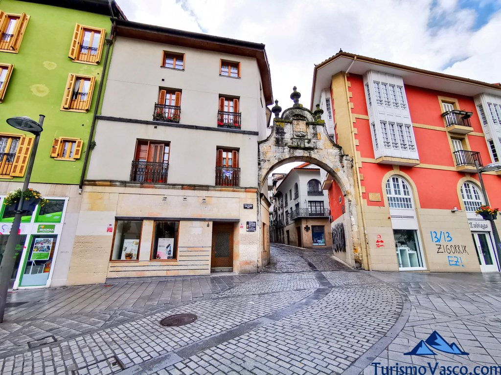

<!DOCTYPE html>
<html>
<head>
    <meta charset='utf-8'>
    <meta http-equiv='X-UA-Compatible' content='IE=edge'>
    <title>Arrasate</title>
    
    <meta name='viewport' content='width=device-width, initial-scale=1'>
    <link rel='stylesheet' type='text/css' media='screen' href='main.css'>
    
</head>
<body>
    <h1> Arrasate</h1>
    <nav>
        <a href="lehena.html">Kokalekua</a>
        <a href="bigarrena.html">Zerbitzuak</a>
        <a href="hirugarrena.html">Mendiak</a>
    </nav>
        <h2><marquee>Web orri honetan, gure herriaren inguruko hainbat zehaztapen aurkitu daitezke. Klikatu atal desberdinak eta ezagutu gure herria, Arrasate!</marquee></h2>
            
</body>
</html>
